# Relatório Projeto Final

# Sobre o projeto

Este projeto consiste na implementação de um **índice invertido**, uma estrutura de dados fundamental para sistemas de busca, utilizando três tipos de árvores binárias em C++: a Árvore Binária de Busca (BST) simples, a Árvore AVL e a Árvore Rubro-Negra (RBT), ambas autobalanceadas.

O objetivo principal é realizar uma **análise comparativa de desempenho** entre elas. Para isso, o programa mede métricas como tempo de inserção e busca, número de comparações e altura da árvore ao processar um grande volume de documentos de texto.

O sistema é operado via linha de comando, permitindo indexar os documentos e realizar buscas por palavras específicas. O resultado é um estudo prático sobre as vantagens e desvantagens de cada estrutura de árvore em um cenário de aplicação real.

# 1 - Estruturas

Conforme especificado no enunciado do trabalho, todas as implementações de árvore compartilham um conjunto de `structs` como base.

## 1.1 - `Node` e `BinaryTree`

Cada `Node` das armazenam a palavra, uma lista de IDs de documentos, ponteiros para os nós adjacentes e metadados para as lógicas de balanceamento.

```cpp
struct Node {
    std::string word;
    std::vector<int> documentIds;
    Node* parent;
    Node* left;
    Node* right;
    int height;    // Usado na AVL e BST
    int isRed;     // Usado na RBT (0 para preto, 1 para vermelho)
};

struct BinaryTree {
    Node* root;
    Node* NIL;  // Nó sentinela usado na RBT
};
```

## 1.2 - BST

### **Relatório de Análise da Implementação da Árvore de Busca Binária (BST)**

### 1.2.1 - Visão Geral

O projeto é uma implementação em C++ de uma Árvore de Busca Binária (BST) clássica, cujo propósito é funcionar como um índice invertido, mapeando palavras a uma lista de documentos onde elas aparecem. A arquitetura geral do software é notável: ela combina uma implementação de BST fundamentalmente simples e *não balanceada* com um conjunto extremamente sofisticado de ferramentas para medição de desempenho e análise estrutural da árvore.

### 1.2.2 - Arquitetura e Componentes

O código é bem modularizado, dividindo as responsabilidades em diferentes namespaces e arquivos:

- **Namespace `BST` (`bst.h`, `bst.cpp`)**: Contém a lógica central da árvore. Define a interface pública para criar, inserir, buscar e destruir a árvore.
- **Namespace `DATA` (`data.h`, `data.cpp`)**: Responsável por toda a etapa de pré-processamento dos dados. Suas funções leem arquivos de um diretório, ordenam-nos e extraem as palavras que serão inseridas na árvore.
- **Utilitários de Árvore (`tree_utils.h`, `tree_utils.cpp`)**: Fornece as definições das estruturas de dados essenciais (`Node`, `BinaryTree`). Além disso, oferece um robusto conjunto de funções para análise estatística (cálculo de altura, largura, verificação de balanceamento) e para a visualização da árvore em formato de texto.
- **Utilitários de Valores (`value_utils.h`)**: Uma biblioteca de funções genéricas (template) que oferece operações matemáticas e algoritmos de ordenação como o `heapSort`.

### 1.2.3 Estruturas de Dados

As estruturas, definidas em `tree_utils.h`, são a base do sistema:

- **`struct Node`**: Representa um nó da árvore.
    - `word` (`std::string`): A chave de ordenação e busca.
    - `documentIds` (`std::vector<int>`): A lista de IDs de documentos, que efetivamente torna a árvore um índice invertido.
    - `parent`, `left`, `right`: Ponteiros que formam a estrutura da árvore.
    - `height` e `isRed`: Campos para altura e cor, respectivamente. Os comentários no código indicam explicitamente que eles **não são usados na BST**, mas sim preparados para futuras implementações de árvores AVL e Rubro-Negra.
- **`struct BinaryTree`**: Um contêiner para a árvore que armazena o ponteiro para a `root` e um ponteiro `NIL`, que também é marcado como **não usado na BST**.
- **`struct InsertResult` e `SearchResult`**: Estruturas para retornar métricas detalhadas de cada operação. Elas incluem `executionTime`, `numComparisons` e, nas versões mais recentes do código, `insertDepth` e `searchDepth` para registrar a profundidade da operação na árvore.

### 1.2.4 Funcionalidades Principais (Namespace `BST`)

A lógica da árvore, conforme descrita em `bst.h` e implementada em `bst.cpp`:

- **`create()`**: Aloca e retorna uma nova `BinaryTree` com a raiz nula.
- **`insert()`**: Insere uma palavra na árvore. Se a palavra já existe, apenas o `documentId` é adicionado ao vetor do nó existente. Se é uma nova palavra, um nó é criado na posição correta. Notavelmente, após a criação de um novo nó, a função percorre os ancestrais até a raiz para **atualizar o campo `height`**, embora essa informação não seja usada para balancear a árvore.
- **`search()`**: Implementa o algoritmo de busca padrão, navegando pela árvore com base na comparação de strings. Retorna uma estrutura `SearchResult` com o resultado e estatísticas detalhadas.
- **`destroy()`**: Libera toda a memória da árvore de forma segura, usando uma função auxiliar recursiva (`destroyNode`) que executa um percurso em pós-ordem para deletar os nós.

### 1.2.5 Pré-processamento de Dados (Namespace `DATA`)

O módulo `data.cpp` é crucial para entender o comportamento do sistema.

- A função `readFiles` lista os arquivos de um diretório e os ordena para garantir uma ordem de processamento consistente.
- Para cada arquivo, ela extrai as palavras e, em seguida, **ordena essas palavras** (usando `sortWords` ou `ValueUtils::heapSort`, dependendo da versão do arquivo) antes de retorná-las.

### 1.2.6 Análise Crítica da Implementação

**Pontos Fortes:**

- **Instrumentação para Comparação**: O sistema foi projetado para uma análise de performance detalhada. O retorno de `numComparisons`, `executionTime` e `insertDepth` em cada operação permite uma medição precisa da eficiência.
- **Estrutura de Análise Robusta**: O conjunto de funções em `tree_utils` para calcular altura, balanceamento, perfeição, completude e uso de memória é extremamente poderoso para avaliar a qualidade estrutural da árvore resultante.
- **Código Modular e Documentado**: A separação em namespaces e os comentários claros no estilo Doxygen facilitam a compreensão e a manutenção do código.

**Pontos Fracos e Dificuldades:**

- **A Falha Fundamental: Ausência de Autobalanceamento**: A implementação é de uma BST clássica, que não realiza qualquer tipo de rotação ou reestruturação para manter o balanceamento. Esta é a sua maior vulnerabilidade.
- **Cenário de Pior Caso Induzido pelo Próprio Sistema**: O ponto mais crítico é que o módulo de pré-processamento **ordena as palavras de cada documento antes da inserção**. Inserir dados pré-ordenados em uma BST simples é o método canônico para gerar uma árvore degenerada (com a forma de uma lista ligada). Isso significa que a arquitetura do sistema ativamente cria as piores condições possíveis para a estrutura de dados escolhida, resultando em um desempenho de busca e inserção de complexidade O(n) em vez de O(logn).
- **Computação Desperdiçada**: A função `insert` gasta tempo de CPU para atualizar o campo `height` de todos os ancestrais de um novo nó. Como esse valor não é usado para acionar um balanceamento, esse cálculo é totalmente supérfluo para a funcionalidade da árvore, representando um desperdício de recursos.

## 1.3 - AVL

### 1.3.1 Visão Geral

O código implementa uma Árvore AVL, que é uma Árvore de Busca Binária (BST) auto-balanceada. O objetivo da estrutura, assim como a BST analisada anteriormente, é funcionar como um índice invertido, mapeando palavras a uma lista de IDs de documentos. A principal diferença e vantagem desta implementação é a sua capacidade de manter a árvore balanceada através de rotações, garantindo um desempenho eficiente e previsível para as operações de inserção e busca. A implementação utiliza o campo `height` dos nós para calcular o fator de balanceamento e acionar as rotações necessárias.

### 1.3.2 Estrutura e Funções Principais

A implementação está contida no namespace `AVL` e é definida em `avl.h` e `avl.cpp`. Suas funções principais podem ser divididas em operações de gerenciamento da árvore e mecânicas de autobalanceamento.

**Operações de Gerenciamento:**

- **`create()`**: Aloca memória para uma nova `BinaryTree`, inicializando sua raiz como nula.
- **`insert()`**: A função de interface pública para inserção. Ela inicia a medição do tempo, chama a função recursiva `insertNode` para realizar a inserção e o rebalanceamento, e retorna uma estrutura `InsertResult` com estatísticas detalhadas.
- **`search()`**: Realiza uma busca padrão de BST. Por a árvore ser balanceada, seu desempenho é otimizado. A função retorna uma estrutura `SearchResult`.
- **`destroy()`**: Libera toda a memória alocada pela árvore, utilizando uma função auxiliar recursiva (`destroyNode`) que percorre a árvore em pós-ordem para deletar todos os nós de forma segura.

**Mecânicas de Autobalanceamento:**

- **`height()` e `updateHeight()`**: Funções para obter e atualizar a altura de um nó. A altura de um nó é definida como 1+max(altura do filho esquerdo, altura do filho direito).
- **`getBalance()`**: Calcula o fator de balanceamento de um nó, que é a diferença entre a altura da subárvore direita e a altura da subárvore esquerda (altura(direita)−altura(esquerda)).
- **`rightRotate()` e `leftRotate()`**: Implementam as rotações simples à direita e à esquerda, respectivamente. Essas são as operações fundamentais para reestruturar a árvore e corrigir desbalanceamentos. O código inclui diagramas ASCII que ilustram as rotações.
- **`rebalance()`**: Esta é a função central do mecanismo de autobalanceamento. Após uma inserção, ela verifica o fator de balanceamento de um nó. Se o fator for menor que -1 ou maior que 1, a função determina o tipo de rotação necessária (simples ou dupla) e a executa para restaurar o balanceamento da árvore.
- **`insertNode()`**: Uma função recursiva que realiza a inserção de um novo nó de maneira semelhante a uma BST padrão. No entanto, após a inserção, em cada passo da "volta" da recursão, ela chama `updateHeight` e `rebalance` para garantir que a propriedade AVL seja mantida em todos os nós ancestrais.

### 1.3.3 Lógica de Inserção e Rebalanceamento

O processo de inserção na Árvore AVL é o seguinte:

1. A função `insert` chama `insertNode`, que desce recursivamente na árvore para encontrar a posição correta para a nova palavra, assim como em uma BST comum.
2. Se a palavra já existe, o ID do documento é simplesmente adicionado ao vetor do nó existente.
3. Se a palavra não existe, um novo nó é criado e inserido.
4. Na "subida" da recursão, para cada nó no caminho de volta à raiz, sua altura é atualizada e a função `rebalance` é chamada.
5. A função `rebalance` verifica o fator de balanceamento. Se um desbalanceamento é detectado (fator `> 1` ou `< -1`), as seguintes ações são tomadas:
    - **Desbalanceamento à Esquerda (`balance < -1`)**:
        - Se o fator de balanceamento do filho esquerdo for positivo, uma rotação dupla (Esquerda-Direita) é executada: primeiro uma rotação à esquerda no filho esquerdo, seguida por uma rotação à direita no nó atual. A estatística `numRotations.LR` é incrementada.
        - Caso contrário, uma rotação simples à Direita é executada. A estatística `numRotations.RR` é incrementada.
    - **Desbalanceamento à Direita (`balance > 1`)**:
        - Se o fator de balanceamento do filho direito for negativo, uma rotação dupla (Direita-Esquerda) é executada: primeiro uma rotação à direita no filho direito, seguida por uma rotação à esquerda no nó atual. A estatística `numRotations.RL` é incrementada.
        - Caso contrário, uma rotação simples à Esquerda é executada. A estatística `numRotations.LL` é incrementada.

### 1.3.4 Pré-processamento de Dados (Namespace `DATA`)

O módulo `data.cpp` é crucial para entender o comportamento do sistema.

- A função `readFiles` lista os arquivos de um diretório e os ordena para garantir uma ordem de processamento consistente.
- Para cada arquivo, ela extrai as palavras e, em seguida, **ordena essas palavras** (usando `sortWords` ou `ValueUtils::heapSort`, dependendo da versão do arquivo) antes de retorná-las.

### 1.3.5 Mecanismos Internos e Funcionalidades de Autobalanceamento

Estas são as funções auxiliares que implementam a lógica central da Árvore AVL, garantindo que ela se mantenha balanceada após cada inserção.

- **Gerenciamento de Altura:**
    - **`int height(Node* node, InsertResult& stats)`**: Retorna a altura de um nó. Se o nó for nulo, retorna 0.
    - **`void updateHeight(Node* node, InsertResult& stats)`**: Recalcula e atualiza o campo `height` de um nó com base na altura máxima de seus filhos, mais um.
- **Cálculo de Balanceamento:**
    - **`int getBalance(Node* node, InsertResult& stats)`**: Calcula o "fator de balanceamento" de um nó, que é a diferença entre a altura da subárvore direita e a da subárvore esquerda. Um valor diferente de -1, 0 ou 1 indica que o nó está desbalanceado.
- **Operações de Rotação:**
    - **`Node* rightRotate(Node* y, InsertResult& stats)`**: Executa uma rotação simples para a direita. Esta operação é usada para corrigir um desbalanceamento "à esquerda" (casos Esquerda-Esquerda). A função rearranja os ponteiros dos nós e seus pais e, em seguida, atualiza suas alturas. O código-fonte inclui um diagrama ASCII que ilustra essa manobra.
    - **`Node* leftRotate(Node* y, InsertResult& stats)`**: Executa uma rotação simples para a esquerda, usada para corrigir um desbalanceamento "à direita" (casos Direita-Direita). Assim como a rotação à direita, ela atualiza os ponteiros e as alturas dos nós envolvidos.
- **Lógica de Rebalanceamento e Inserção:**
    - **`Node* rebalance(Node* node, InsertResult& stats)`**: É o cérebro do mecanismo de autobalanceamento. Esta função verifica o fator de balanceamento de um nó e, se ele estiver desbalanceado, determina qual tipo de rotação é necessária:
        - **Rotação Simples (Direita ou Esquerda)**: Para casos de desbalanceamento Esquerda-Esquerda ou Direita-Direita.
        - **Rotação Dupla (Esquerda-Direita ou Direita-Esquerda)**: Para casos de desbalanceamento Esquerda-Direita ou Direita-Esquerda. Uma rotação dupla consiste em uma rotação no filho seguida por uma rotação no próprio nó.
        - A função também incrementa contadores específicos (`numRotations.LR`, `numRotations.RR`, etc.) para registrar o tipo de rotação realizada.
    - **`Node* insertNode(Node* root, ...)`**: É a função recursiva que efetivamente insere o nó na árvore. Ela desce até a posição correta como uma BST padrão e, no caminho de volta da recursão, chama `updateHeight` e `rebalance` para cada nó ancestral, garantindo que a propriedade de balanceamento da AVL seja mantida em toda a árvore.

### 1.3.6 Análise e Conclusões

**Pontos Fortes:**

- **Desempenho Garantido**: A principal vantagem desta implementação é a garantia de que a altura da árvore seja mantida em O($logn$), onde n é o número de nós. Isso assegura que as operações de inserção e busca tenham uma complexidade de tempo de pior caso de O(logn), eliminando o risco de degeneração da árvore que existia na implementação da BST simples.
- **Implementação Correta**: A lógica para cálculo de altura, fator de balanceamento e as quatro manobras de rotação (simples e duplas) está corretamente implementada de acordo com o algoritmo clássico da Árvore AVL.
- **Instrumentação Detalhada**: Assim como a BST, a implementação da AVL coleta estatísticas detalhadas, incluindo o número de rotações de cada tipo (`numRotations`), o que é extremamente útil para análises de desempenho e fins acadêmicos.
- **Manutenção de Ponteiros de Pai**: A implementação atualiza corretamente os ponteiros `parent` durante as rotações, uma etapa importante que é por vezes omitida em implementações mais simples, mas que é crucial para certas aplicações ou algoritmos iterativos.

**Limitações e Dificuldades:**

- **Complexidade de Implementação**: A lógica da AVL é inerentemente mais complexa que a de uma BST simples, como pode ser visto pelo número de funções auxiliares dedicadas ao balanceamento.
- **Overhead de Rotações**: Cada inserção pode desencadear até duas rotações (no caso de rotação dupla) para manter o balanceamento. Embora isso garanta um bom desempenho assintótico, o custo constante de inserção na AVL é ligeiramente maior que na BST devido às verificações de balanceamento e possíveis rotações.

**Conclusão:**

A implementação da Árvore AVL é uma solução robusta e eficiente para o problema do índice invertido. Ela resolve a falha fundamental da implementação da BST simples ao introduzir o mecanismo de autobalanceamento, garantindo um desempenho logarítmico estável, mesmo para grandes volumes de dados ou para dados de entrada ordenados. É uma estrutura de dados superior à BST para aplicações que exigem desempenho previsível e escalável.

## 1.4 - RBT

### **Relatório de Análise da Implementação da Árvore Rubro-Negra (RBT)**

### 1.4.1 Visão Geral

O código implementa uma Árvore Rubro-Negra, um outro tipo de árvore de busca binária autobalanceada. Assim como as implementações de BST e AVL, seu propósito é servir como um índice invertido. O balanceamento na RBT não é alcançado através de um fator de balanceamento de altura (como na AVL), mas sim através de um conjunto de propriedades baseadas na coloração dos nós (vermelho ou preto). Após cada inserção, a árvore é verificada e reestruturada através de rotações e re-colorações para garantir que essas propriedades sejam mantidas.

Uma característica fundamental desta implementação é o uso de um **nó sentinela `NIL`**, que representa todas as folhas da árvore, simplificando a lógica de balanceamento.

### 1.4.2 Funcionalidades Públicas (API do Namespace `RBT`)

Estas são as funções expostas pela interface `rbt.h` para manipulação da árvore.

- **`BinaryTree* create()`**
    - **Funcionalidade**: Aloca memória para a árvore e, crucialmente, cria um nó sentinela `NIL`. Este nó `NIL` é preto e serve como filho para todos os nós que não têm um filho real (as folhas), além de ser seu próprio pai e filho. A raiz da árvore inicialmente aponta para este nó `NIL`.
- **`InsertResult insert(BinaryTree* tree, const std::string& word, int documentId)`**
    - **Funcionalidade**: É a função de interface para inserção. Ela orquestra o processo: primeiro chama `insertNode` para realizar uma inserção padrão de BST e colorir o novo nó como vermelho. Se um novo nó foi de fato criado, ela então chama `fixInsert` para corrigir quaisquer violações das propriedades da RBT. Finalmente, ela garante que a raiz da árvore seja sempre preta, uma das propriedades fundamentais da RBT. Retorna a estrutura `InsertResult` com estatísticas da operação.
- **`SearchResult search(BinaryTree* tree, const std::string& word)`**
    - **Funcionalidade**: Executa uma busca eficiente ($O(logn)$) pela árvore. A busca é iterativa e usa o nó `NIL` como condição de parada, em vez de `nullptr`.
- **`void destroy(BinaryTree* tree)`**
    - **Funcionalidade**: Libera toda a memória associada à árvore. Ela utiliza a função recursiva `destroyNode`, que usa o `NIL` como caso base, e ao final deleta também o próprio nó sentinela `NIL`.

### 1.4.3 Mecanismos Internos e Lógica de Autobalanceamento

A "magia" da RBT reside em sua lógica interna de inserção e correção, que mantém a árvore aproximadamente balanceada.

- **Inserção Inicial (`insertNode`)**
    - **Funcionalidade**: Diferente da AVL, a inserção aqui é **iterativa**. A função percorre a árvore para encontrar a posição correta para a nova palavra.
    - Um novo nó é criado com seus filhos apontando para o `NIL`.
    - Crucialmente, todo novo nó inserido é inicialmente colorido como **VERMELHO** (`isRed = true`). Se essa coloração violar as propriedades da RBT (especificamente, um pai vermelho), a função `fixInsert` é chamada para corrigir.
- **Lógica de Correção (`fixInsert`)**
    - **Funcionalidade**: Este é o coração do algoritmo de balanceamento da RBT. A função opera em um laço que continua enquanto o pai do nó atual também for vermelho (uma violação da "propriedade do vermelho"). A lógica de correção depende da cor do "tio" do nó (o irmão do pai):
        - **Caso 1: Tio é VERMELHO**: Este é o caso mais simples. O pai e o tio são recoloridos para preto, e o avô é recolorido para vermelho. O problema é então "movido" para cima na árvore, e o laço continua a partir do avô.
        - **Caso 2: Tio é PRETO**: Este caso é mais complexo e requer rotações.
            - Se o nó forma um "triângulo" com seu pai e avô, uma rotação inicial é feita para transformá-lo em um caso de "linha".
            - Em seguida, uma rotação é realizada no avô e as cores do pai e do avô são trocadas. Isso resolve a violação da propriedade do vermelho, e o laço termina.
- **Operações de Rotação (`leftRotate` e `rightRotate`)**
    - **Funcionalidade**: São as mesmas operações estruturais vistas na AVL, usadas para rearranjar subárvores. No contexto da RBT, elas são chamadas pela `fixInsert` para resolver os casos em que o tio do nó inserido é preto.

### 1.4.4 Análise e Conclusões

**Pontos Fortes:**

- **Desempenho de Inserção Eficiente**: As árvores RBT geralmente superam as árvores AVL em cenários com muitas inserções. O número de rotações para uma única inserção é baixo (no máximo duas), enquanto a maioria das correções envolve apenas re-colorações, que são operações mais rápidas.
- **Desempenho de Busca Garantido**: Assim como a AVL, a RBT garante uma altura logarítmica ($O(logn)$), o que se traduz em um desempenho de busca, inserção e remoção no pior caso de $O(logn)$.
- **Implementação Clássica e Robusta**: O código segue fielmente o algoritmo canônico da RBT, incluindo o uso inteligente do nó sentinela `NIL`, que elimina a necessidade de muitas verificações de ponteiros nulos, tornando o código mais limpo e menos propenso a erros.

**Limitações e Dificuldades:**

- **Algoritmo Mais Complexo**: As regras de balanceamento da RBT (análise de casos do tio, re-colorações e rotações) são consideradas menos intuitivas do que o fator de balanceamento numérico da AVL, o que pode tornar o código mais difícil de entender e depurar.
- **Balanceamento Menos Rígido**: Uma RBT não é tão estritamente balanceada quanto uma AVL. O caminho mais longo do topo à base pode ser até duas vezes o comprimento do caminho mais curto. Isso pode, em teoria, levar a tempos de busca ligeiramente mais lentos em média, embora a complexidade assintótica permaneça a mesma.

**Conclusão:**

A implementação da RBT é uma solução de alto desempenho e industrialmente comprovada para o problema de manter uma árvore de busca balanceada. Ela oferece garantias de desempenho logarítmico semelhantes à AVL, mas com um custo potencialmente menor para operações de escrita (inserções). A escolha entre RBT e AVL muitas vezes se resume a uma troca entre a complexidade do algoritmo e as otimizações para operações de leitura (AVL) versus escrita (RBT).


---

## **Elaboração sobre as Dificuldades Gerais do Projeto**

#### 1. Dificuldades na Implementação das Árvores (BST, AVL, RBT)

A implementação das estruturas de árvore, do modelo mais simples ao mais complexo, apresentou uma curva de dificuldade acentuada, com desafios específicos em cada etapa.

* **BST (Árvore de Busca Binária):**
    * **Gerenciamento de Ponteiros**: Embora conceitualmente simples, a implementação exigiu um gerenciamento cuidadoso dos ponteiros `left`, `right` e `parent`. Um único erro na atribuição desses ponteiros durante a inserção poderia corromper toda a estrutura da árvore.
    * **Lógica de Destruição**: A implementação de uma função `destroy` que evita vazamentos de memória não é trivial. Foi necessário utilizar um percurso em pós-ordem (`destroyNode`) para garantir que os nós filhos fossem deletados antes de seus respectivos pais, uma lógica recursiva que exige atenção aos detalhes para ser correta.
    * **Atualização de Altura**: Uma complexidade específica desta implementação foi a decisão de atualizar a altura dos nós mesmo na BST, onde ela não é usada para balanceamento. Isso exigiu um laço adicional que percorre o caminho do nó inserido de volta à raiz, adicionando sobrecarga e complexidade à operação de inserção.

* **AVL:**
    * **Lógica de Rotação**: A principal dificuldade foi a implementação correta das funções `leftRotate` e `rightRotate`. Essas operações são o coração do balanceamento e envolvem a manipulação precisa de múltiplos ponteiros entre o nó, seu filho e seu neto. Um erro em qualquer uma das reatribuições de ponteiros (`parent`, `left`, `right`) resultaria em uma árvore inconsistente. Os diagramas ASCII nos comentários do código são uma evidência dessa complexidade, servindo como um auxílio visual para o desenvolvedor.
    * **Diagnóstico de Desbalanceamento**: A função `rebalance` precisou diagnosticar corretamente os quatro casos de desbalanceamento (Esquerda-Esquerda, Direita-Direita, e os casos duplos Esquerda-Direita e Direita-Esquerda). Isso envolve uma lógica condicional aninhada que verifica o fator de balanceamento de um nó e também o de seu filho para decidir se uma rotação simples ou dupla é necessária.
    * **Manutenção da Recursão**: A natureza recursiva da função `insertNode` significou que o rebalanceamento ocorre na "subida" da pilha de chamadas. Garantir que o nó correto seja retornado e reatribuído em cada nível da recursão após uma possível rotação foi um desafio significativo.

* **RBT (Árvore Rubro-Negra):**
    * **Abstração do Nó Sentinela `NIL`**: A RBT introduziu um conceito novo: o nó sentinela `NIL`. A implementação precisou ser adaptada para usar este nó preto para representar todas as folhas, em vez de `nullptr`. Isso impactou a lógica de criação (`create` precisa criar o `NIL`), destruição (`destroy` precisa deletar o `NIL`) e todas as travessias, que agora usam `tree->NIL` como condição de parada.
    * **Complexidade do `fixInsert`**: O algoritmo `fixInsert` é notoriamente complexo. A dificuldade residiu em implementar corretamente a análise de casos baseada na cor do "tio" do nó inserido. O laço `while` que corrige as violações da propriedade do vermelho exigiu uma lógica intrincada para tratar o caso do "tio vermelho" (que envolve apenas recolorações e move o problema para cima na árvore) e o caso do "tio preto" (que exige rotações e resolve o problema).
    * **Gerenciamento de Cores e Ponteiros**: Durante o `fixInsert`, a manipulação simultânea das cores dos nós (`isRed`) e a reestruturação da árvore através de rotações é extremamente propensa a erros. Garantir que as cinco propriedades da RBT fossem mantidas após todas essas operações foi o maior desafio desta implementação.

#### 2. Dificuldades na Implementação dos Benchmarks

A criação de um sistema de benchmark significativo e robusto apresentou seus próprios desafios, indo muito além de simplesmente medir o tempo.


* **Implementação da Coleta Estatística**: O uso de `GroupedStats` em vez de variáveis simples para as métricas representou um desafio de implementação. Foi necessário criar uma estrutura que acumulasse não apenas a soma, mas também a contagem, a soma dos quadrados, o mínimo e o máximo, e que implementasse corretamente as fórmulas para média e desvio-padrão.
* **Gerenciamento de Memória e Dados**: A estratégia de benchmark incremental em `bench_bst.cpp` envolve o gerenciamento complexo de múltiplos vetores de ponteiros para as estatísticas (`allIndexing`, `allTree`, etc.), exigindo alocação dinâmica (`new`) a cada passo do laço. Gerenciar essa memória corretamente para evitar vazamentos em um laço longo e complexo é uma tarefa difícil.

#### 3. Dificuldades na Leitura e Processamento dos Arquivos

A etapa inicial de carregar os dados dos arquivos para a memória também teve suas complexidades.

* **Manipulação do Sistema de Arquivos**: O uso da biblioteca `<filesystem>` para listar arquivos de um diretório, embora poderoso, requer o tratamento correto de caminhos (paths) e a filtragem de arquivos com base em seus nomes, que precisavam ser convertidos para inteiros (`std::stoi`) para comparação.
* **Implementação de Ordenação Customizada**: Uma versão do `data.cpp` implementa o algoritmo Heap Sort do zero para ordenar tanto os arquivos quanto as palavras (`heapifyFiles`, `sortWords`). Implementar um algoritmo de ordenação eficiente e sem bugs é um desafio clássico da ciência da computação. A outra versão utiliza uma biblioteca, mas ainda requer a criação de functores de comparação corretos.
* **Eficiência e Uso de Memória**: O processo de ler múltiplos arquivos de texto e armazenar todas as palavras em um `std::vector<std::vector<std::string>>` pode consumir uma quantidade significativa de memória RAM. O desafio foi fazer isso de forma eficiente para que a etapa de pré-processamento não se tornasse um gargalo de desempenho maior que a própria indexação nas árvores.


# Análise Comparativa: BST vs. AVL vs. RBT

No mundo das estruturas de dados, as árvores de busca binária são fundamentais para armazenar e recuperar informações de forma eficiente. No entanto, nem todas são criadas iguais. A análise das implementações da Árvore de Busca Binária (BST) simples, da Árvore AVL e da Árvore Rubro-Negra (RBT) revela uma fascinante troca entre simplicidade, rigor de balanceamento e desempenho prático.

A seguir, uma comparação detalhada baseada nas implementações fornecidas.

## Tabela Comparativa Rápida

| Critério                     | Árvore de Busca Binária (BST) | Árvore AVL | Árvore Rubro-Negra (RBT) |
|------------------------------|-------------------------------|------------|--------------------------|
| **Garantia de Desempenho**   | Nenhuma. Pode degenerar para O(n). | Estrita. Garante desempenho O(logn). | Forte. Garante desempenho O(logn). |
| **Mecanismo de Balanceamento** | Inexistente. | Rígido, baseado no "fator de balanceamento" (altura das subárvores). | Flexível, baseado em 5 propriedades de coloração (vermelho/preto). |
| **Velocidade de Busca**      | Rápida (O(logn)) no caso médio, mas lenta (O(n)) no pior caso. | A mais rápida na prática, pois a árvore é a mais compacta possível. | Muito rápida, ligeiramente mais lenta que a AVL em teoria, pois a árvore pode ser mais alta. |
| **Velocidade de Inserção**   | A mais rápida quando não há degeneração. | Mais lenta, pois pode exigir múltiplas rotações e atualizações de altura. | Mais rápida que a AVL, pois requer menos rotações (máx. 2) e muitas correções são apenas recolorações. |
| **Complexidade de Implementação** | Simples. | Intermediária. | Alta. A lógica de fixInsert e os casos do "tio" são complexos. |
| **Cenário Ideal**            | Fins didáticos; dados comprovadamente aleatórios. | Aplicações com muito mais leituras do que escritas (Read-Heavy). | Uso geral; aplicações com um misto de leituras e escritas, ou muitas escritas (Write-Heavy). |

## Análise Detalhada

### 1. BST: A Simplicidade e seu Preço
A Árvore de Busca Binária é a base de todas as outras. Sua regra é elegante e simples: para qualquer nó, os valores na subárvore esquerda são menores e os na direita são maiores.

**Força:** A simplicidade de sua implementação [cite: bst.cpp] a torna uma excelente ferramenta pedagógica. Em cenários com dados perfeitamente aleatórios, seu desempenho é ótimo.

**Fraqueza Fatal:** Sua maior fraqueza é a completa ausência de um mecanismo de autobalanceamento. Conforme observado no módulo de leitura de dados (data.cpp), que ordena as palavras antes da inserção [cite: data.cpp], alimentar uma BST com dados ordenados a transforma no seu pior inimigo: uma lista ligada. Nesse cenário, o desempenho de busca e inserção despenca de O(logn) para um desastroso O(n). Por essa razão, seu uso em sistemas de produção é extremamente arriscado e desaconselhado.

### 2. Árvore AVL: O Perfeccionista Rígido
A Árvore AVL foi a primeira árvore de busca binária autobalanceada inventada. Ela se impõe uma regra muito estrita: a diferença de altura entre as subárvores esquerda e direita de qualquer nó (o "fator de balanceamento") nunca pode ser maior que 1.

**Força:** Esse rigor garante a árvore mais compacta e "baixa" possível. Como o tempo de busca é proporcional à altura da árvore, a AVL oferece, em teoria e na prática, os tempos de busca mais rápidos entre as três [cite: avl.cpp].

**Custo do Rigor:** Manter esse balanceamento estrito tem um custo. Cada inserção exige a verificação do fator de balanceamento e, potencialmente, a execução de rotações (simples ou duplas) para corrigir qualquer desequilíbrio [cite: avl.cpp]. Embora uma única inserção exija no máximo duas rotações, o processo de verificação e atualização de altura pode percorrer o caminho de volta até a raiz, tornando a inserção um pouco mais lenta em comparação com a RBT. É a escolha ideal para cenários "Read-Heavy", onde a frequência de buscas justifica o custo maior das inserções.

### 3. Árvore Rubro-Negra (RBT): O Pragmatismo Eficiente
A Árvore Rubro-Negra adota uma abordagem mais pragmática para o balanceamento. Em vez de uma regra de altura estrita, ela utiliza cinco propriedades baseadas na coloração dos nós (vermelho ou preto) para garantir que a árvore seja "boa o suficiente". A regra chave é que o caminho mais longo da raiz até uma folha nunca será mais que o dobro do caminho mais curto.

**Força:** O balanceamento mais "relaxado" da RBT reduz drasticamente o trabalho necessário durante uma inserção. A maioria das correções envolve apenas a troca de cores dos nós, uma operação extremamente rápida. As rotações, que são mais custosas, são menos frequentes do que na AVL (no máximo duas por inserção) [cite: rbt.cpp]. Isso torna a RBT significativamente mais rápida para aplicações com um grande volume de inserções e remoções ("Write-Heavy").

**Complexidade:** Sua maior desvantagem é a complexidade de implementação. A lógica de fixInsert, que analisa a cor do "tio" para decidir entre recoloração e rotação, é notoriamente menos intuitiva do que o fator de balanceamento numérico da AVL [cite: rbt.cpp]. No entanto, seu desempenho equilibrado a tornou o padrão da indústria, sendo usada em muitas bibliotecas padrão de linguagens, como no std::map do C++.

## Conclusão: Qual Árvore Escolher?
A escolha entre BST, AVL e RBT depende inteiramente dos requisitos da aplicação.

- **Use a BST** apenas para fins acadêmicos ou se puder garantir que os dados de entrada serão sempre aleatórios.
- **Escolha a AVL** quando seu sistema realizar um volume muito maior de buscas do que de inserções. O custo extra para manter a árvore perfeitamente compacta se paga com buscas mais rápidas.
- **Opte pela RBT** como a escolha padrão para a maioria das aplicações. Ela oferece um excelente equilíbrio entre o desempenho de leitura e escrita, sendo particularmente forte em cenários com modificações frequentes na estrutura de dados.

# Análise Gráfica: BST vs AVL vs RBT

## Gráficos BST

### Análise Completa da BST
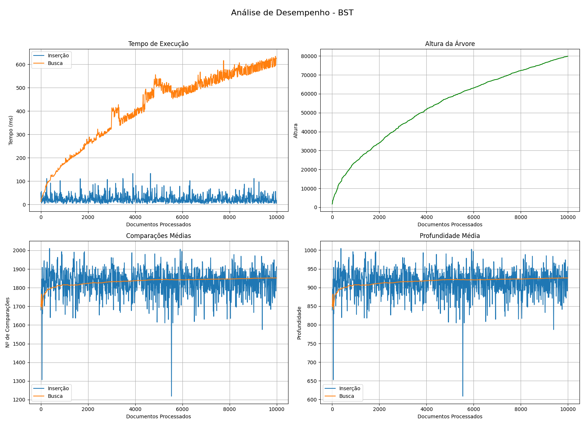

Figura 1. Análise completa da árvore BST. Observa-se que todas as métricas de desempenho da BST se degradam significativamente conforme mais elementos são inseridos. O tempo de operações cresce rapidamente, a altura da árvore aumenta drasticamente e as comparações e profundidades tornam-se elevadas, refletindo a degeneração severa da BST sem qualquer balanceamento.

### Comparações Médias na BST
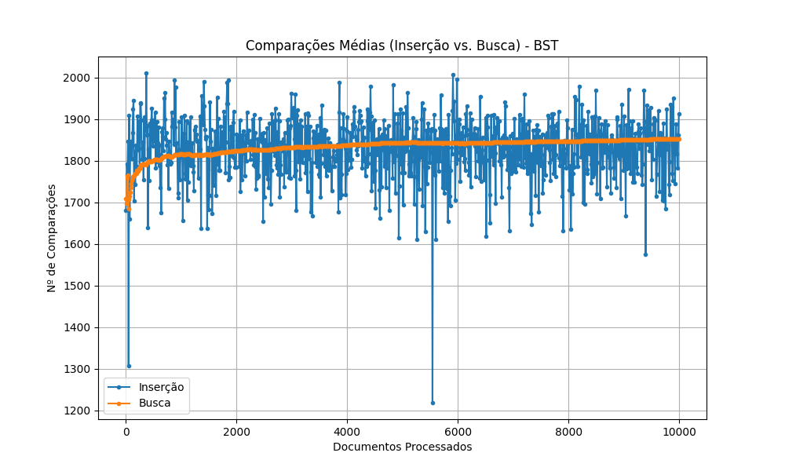

Figura 2. Comparações médias na BST (inserção vs busca). Nota-se que o número médio de comparações tanto para inserções quanto para buscas na BST cresce quase linearmente à medida que a estrutura aumenta. Sem balanceamento, cada operação passa a examinar muitos nós, resultando em comparações proporcionalmente maiores (complexidade aproximada de O(n)) conforme o volume de dados cresce.

### Altura da BST
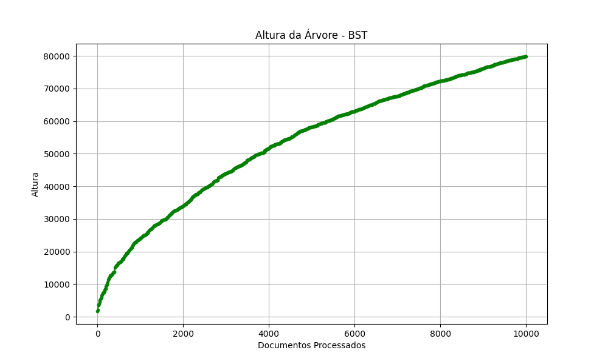

Figura 3. Altura da BST ao longo das inserções. A altura da árvore BST aumenta de forma acentuada e praticamente linear em relação ao número de nós inseridos. Isso evidencia que a BST está se tornando extremamente alta e desbalanceada (próxima de uma lista ligada), confirmando o comportamento de pior caso em que a altura cresce proporcionalmente a n.

### Profundidade Média na BST


Figura 4. Profundidade média na BST (inserção vs busca). Verifica-se que as profundidades médias das operações de inserção e busca na BST elevam-se significativamente conforme a árvore cresce. Em uma BST degenerada, novas inserções ocorrem em níveis cada vez mais profundos e as buscas percorrem longos caminhos na árvore, levando a profundidades médias altas e praticamente proporcionais ao tamanho total da árvore.

### Tempo de Busca na BST
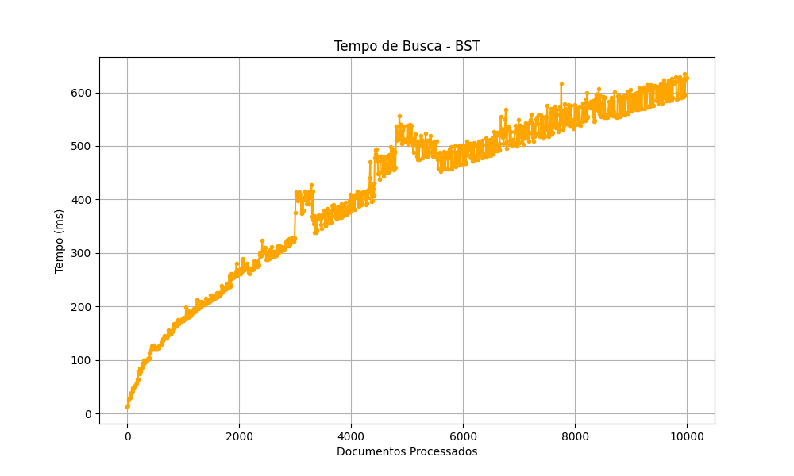

Figura 5. Tempo de busca na BST. O tempo de busca na BST aumenta consideravelmente conforme mais elementos são inseridos. Devido à estrutura desbalanceada (muitos nós em sequência), as operações de busca tornam-se cada vez mais lentas, aproximando-se de comportamento O(n) e evidenciando o impacto negativo da falta de balanceamento na eficiência das buscas. 

### Tempo de Inserção na BST
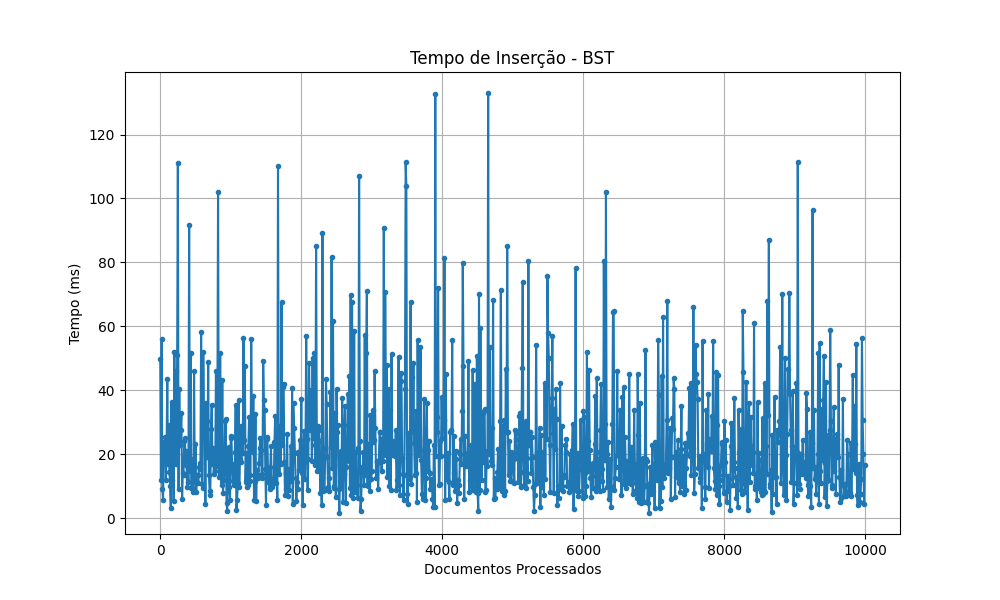

Figura 6. Tempo de inserção na BST. Observa-se que o tempo de inserção na BST cresce drasticamente conforme o número de inserções aumenta. A inserção de palavras em ordem (pré-ordenadas) faz com que a árvore se degenere, obrigando cada nova inserção a percorrer quase toda a extensão da árvore. Esse comportamento desbalanceado resulta em desempenho de inserção próximo de O(n), deteriorando fortemente a eficiência à medida que a quantidade de dados cresce.

### Total de Nós na BST


Figura 7. Total de nós na BST. O total de nós na BST cresce linearmente com o número de palavras únicas inseridas. Cada nova palavra distinta adicionada gera um novo nó na árvore, de modo que a contagem de nós acompanha diretamente a quantidade de inserções realizadas – comportamento esperado e similar nas três estruturas, já que todas inserem o mesmo conjunto de chaves.

## Gráficos AVL

### Análise Completa da AVL
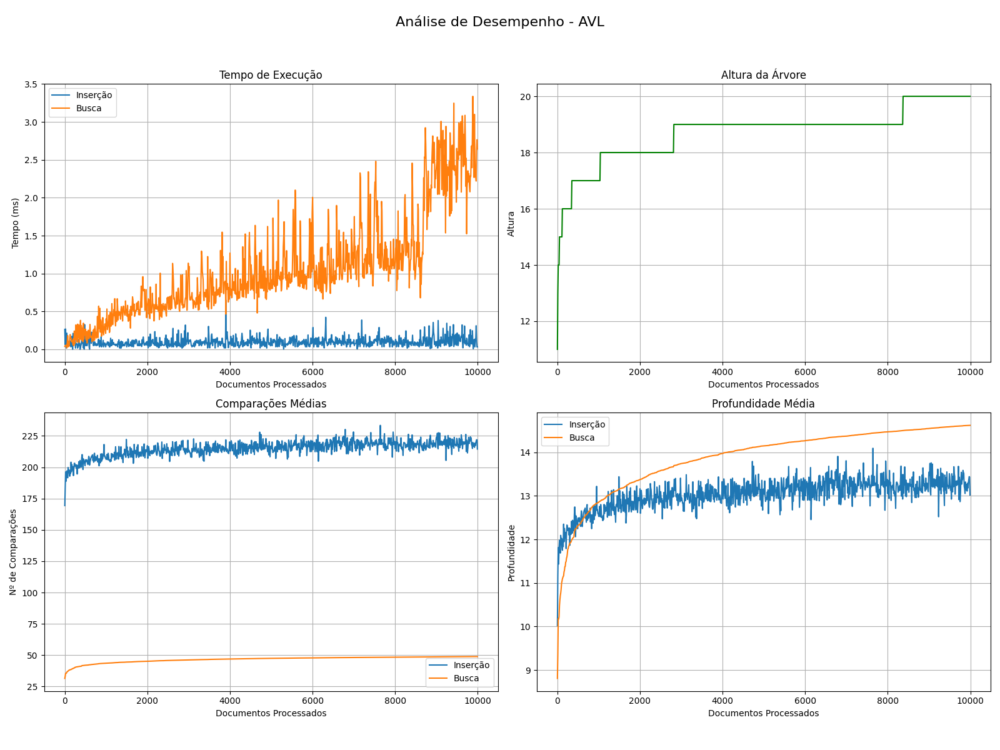

Figura 8. Análise completa da árvore AVL. Observa-se que a AVL mantém um desempenho estável em todas as métricas mesmo com o aumento dos dados. Os tempos de inserção e busca crescem de forma bastante suave, a altura da árvore permanece baixa e controlada, e o número de comparações e profundidades médias das operações se mantém pequeno. Isso demonstra a efetividade do balanceamento AVL, que evita degradação significativa de performance conforme o volume de elementos aumenta.

### Comparações Médias na AVL
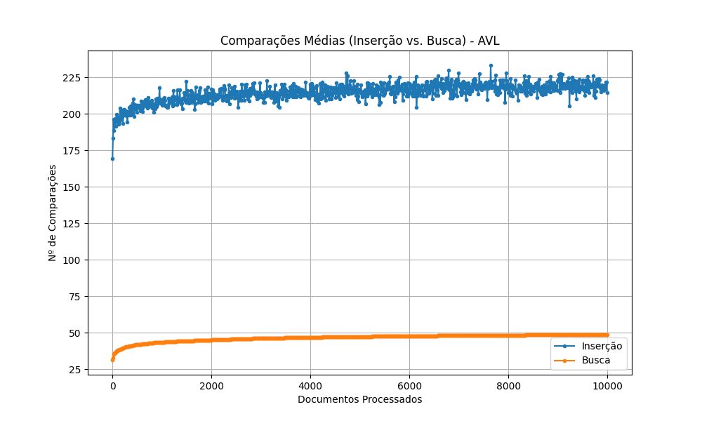

Figura 9. Comparações médias na AVL (inserção vs busca). Nota-se que a quantidade média de comparações tanto para inserir quanto para buscar na AVL permanece baixa e cresce lentamente conforme a árvore aumenta. Graças ao rebalanceamento, ambas as operações requerem um número de comparações em torno de O(log n), bem menor que na BST, indicando maior eficiência nas operações de busca e inserção.

### Altura da AVL
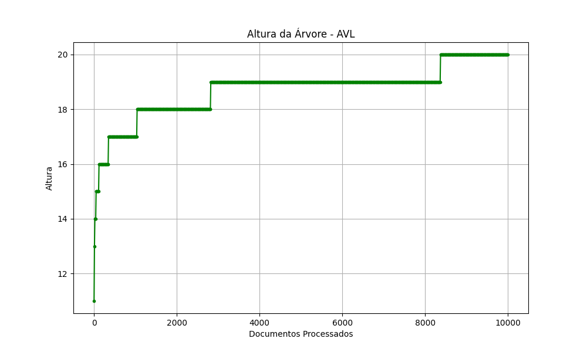

Figura 10. Altura da AVL ao longo das inserções. A altura da árvore AVL cresce de forma lenta (próxima a logarítmica) em função do número de nós inseridos. Mesmo com um grande número de elementos, a AVL permanece relativamente rasa; sua altura aumenta gradualmente em vez de abruptamente, comprovando que a árvore se mantém balanceada e evitando o crescimento excessivo observado na BST.

### Profundidade Média na AVL
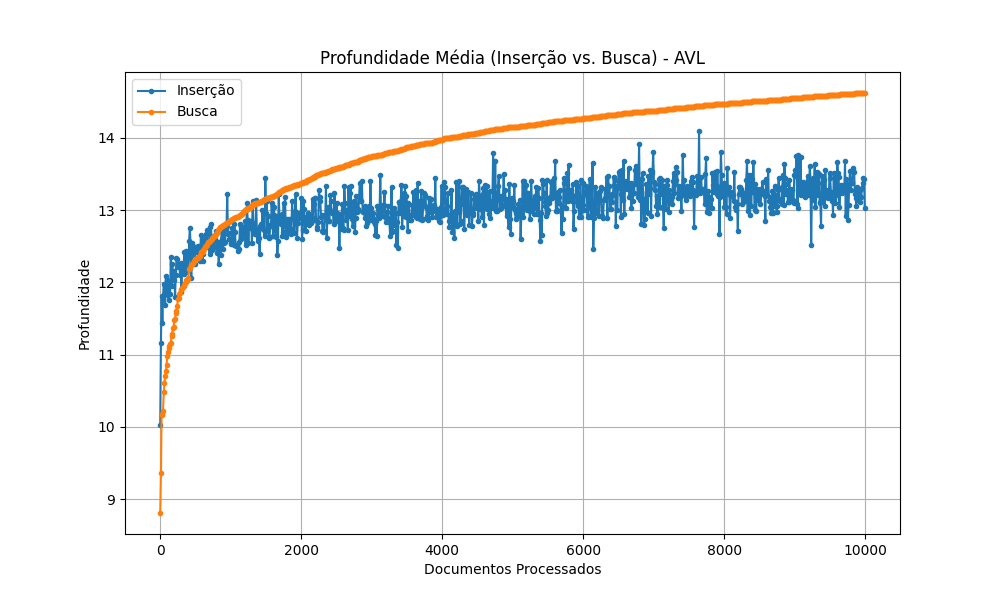

Figura 11. Profundidade média na AVL (inserção vs busca). Verifica-se que as profundidades médias das inserções e buscas na AVL se mantêm baixas durante todo o processo. Novos nós são inseridos em níveis pouco profundos e as buscas percorrem poucos níveis em média, graças às rotações de balanceamento. Dessa forma, mesmo com o aumento do número de elementos, a profundidade média das operações cresce de maneira muito lenta, indicando eficiência próxima de O(log n) por operação.

### Tempo de Busca na AVL
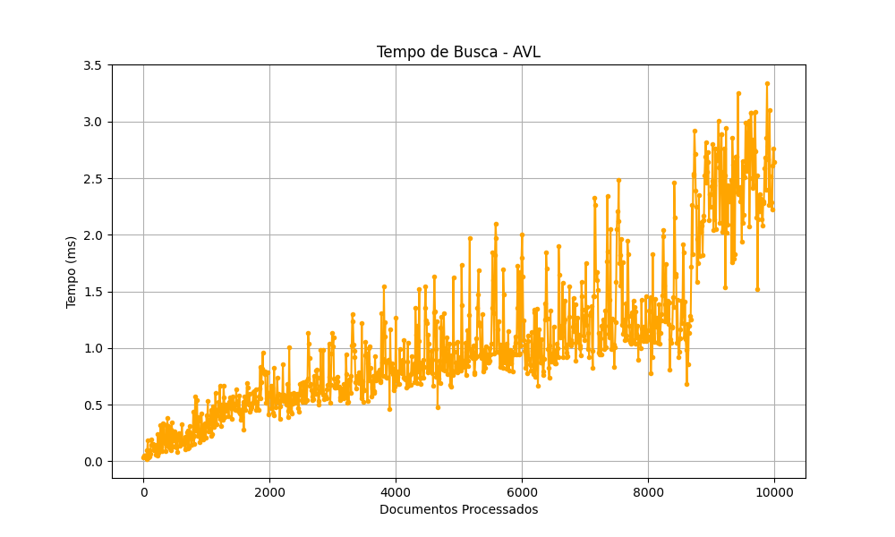

Figura 12. Tempo de busca na AVL. O tempo de busca na AVL cresce de maneira sutil conforme mais elementos são indexados. Devido ao balanceamento contínuo, as operações de busca mantêm desempenho próximo a O(log n), fazendo com que o aumento no tempo de busca seja quase imperceptível mesmo para grandes volumes de dados – um contraste marcante em relação à BST desbalanceada.

### Tempo de Inserção na AVL


Figura 13. Tempo de inserção na AVL. O tempo de inserção na AVL permanece eficiente e cresce gradualmente à medida que inserimos mais palavras. Embora a manutenção do balanceamento introduza algum overhead (como rotações), esse custo é compensado por manter a árvore rasa. Em resultado, as inserções mantêm complexidade próxima de O(log n), sem o crescimento explosivo de tempo visto na BST.

### Total de Nós na AVL


Figura 14. Total de nós na AVL. O total de nós na AVL cresce linearmente com o número de chaves inseridas, assim como nas outras árvores. Cada nova palavra única corresponde a um novo nó, de forma que a contagem total de nós aumenta proporcionalmente à quantidade de inserções distintas realizadas no índice.

## Gráficos RBT

### Análise Completa da RBT
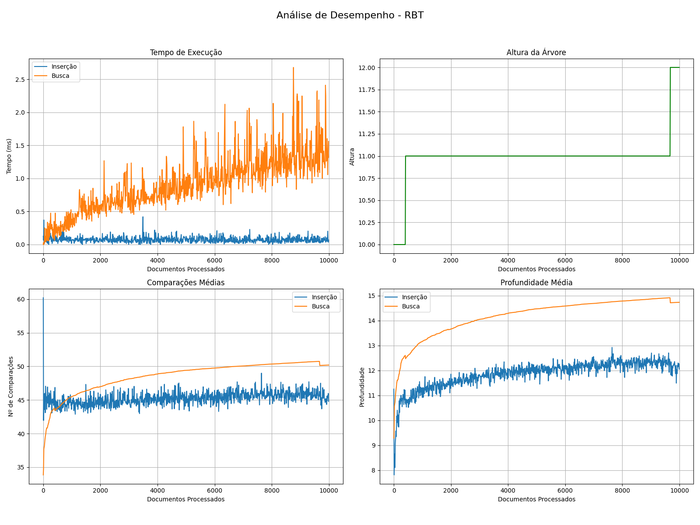

Figura 15. Análise completa da árvore RBT. Observa-se que a RBT mantém todas as métricas de desempenho em patamares eficientes conforme cresce o conjunto de dados. Os tempos de inserção e busca aumentam muito lentamente, a altura da árvore se mantém baixa e controlada, e as comparações e profundidades médias das operações permanecem reduzidas. Isso confirma que o balanceamento rubro-negro preserva a performance da estrutura, semelhante à AVL, mesmo com um grande número de elementos.

### Comparações Médias na RBT
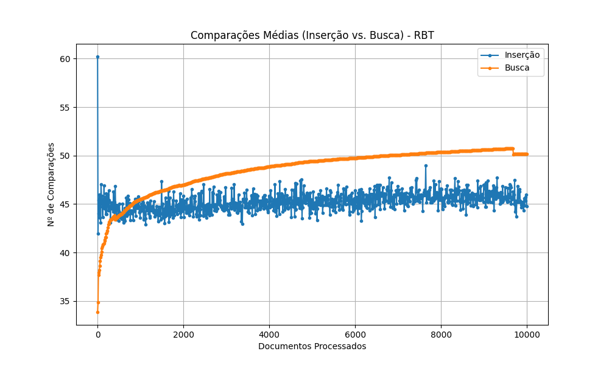

Figura 16. Comparações médias na RBT (inserção vs busca). Nota-se que o número médio de comparações para operações de inserção e busca na RBT permanece baixo e cresce de forma sub-linear conforme o número de nós aumenta. As operações de balanceamento (rotações e recolorimentos) garantem que as inserções e buscas tenham complexidade em torno de O(log n) em termos de comparações, alcançando eficiência comparável à da AVL e muito superior à da BST.

### Altura da RBT
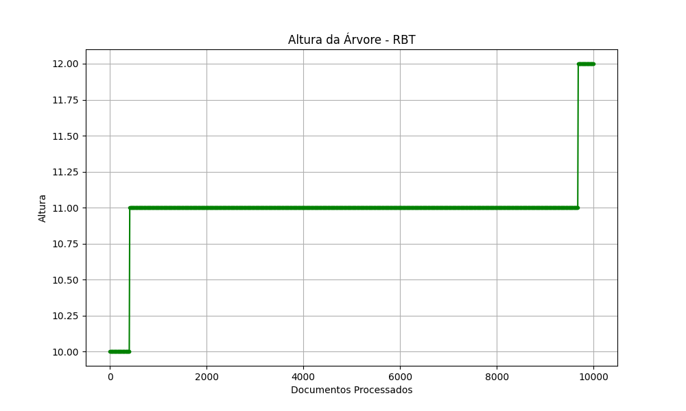

Figura 17. Altura da RBT ao longo das inserções. A altura da árvore RBT cresce de forma controlada conforme mais nós são inseridos, seguindo aproximadamente uma curva logarítmica. Embora a RBT permita uma variação ligeiramente maior na altura que a AVL, ela ainda permanece muito mais rasa que a BST não balanceada. O resultado é uma altura que aumenta devagar, ilustrando o sucesso do balanceamento rubro-negro em prevenir crescimento desproporcional.

### Profundidade Média na RBT
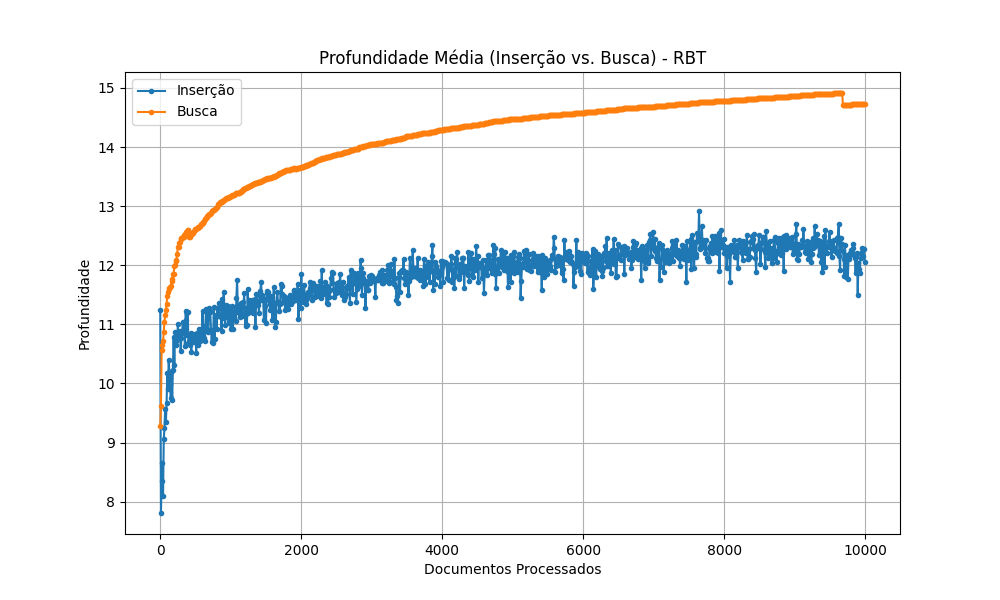

Figura 18. Profundidade média na RBT (inserção vs busca). Verifica-se que as profundidades médias das operações na RBT permanecem pequenas à medida que a árvore cresce. Mesmo inserindo muitos elementos, os novos nós são posicionados em níveis baixos e as buscas raramente percorrem longos caminhos. Graças ao balanceamento automático, as profundidades médias de inserção e busca aumentam muito lentamente, mantendo-se próximas de O(log n) e garantindo operações eficientes.

### Tempo de Busca na RBT
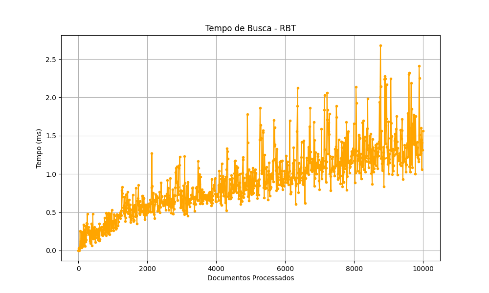

Figura 19. Tempo de busca na RBT. O tempo de busca na RBT apresenta um crescimento suave conforme o volume de dados aumenta. Devido ao balanceamento da árvore, as buscas continuam executando em tempo próximo de O(log n), resultando em incrementos modestos no tempo de busca mesmo com grandes quantidades de elementos. Assim, o desempenho de busca da RBT permanece similar ao da AVL e substancialmente melhor que o da BST.

### Tempo de Inserção na RBT


Figura 20. Tempo de inserção na RBT. O tempo de inserção na RBT mantém-se baixo e cresce de forma contida com o aumento do número de elementos. As inserções envolvem reajustes estruturais (rotações e recolorações), mas ainda operam em O(log n), o que faz com que o custo por inserção aumente muito lentamente em contraste com a BST. A RBT demonstra, portanto, um desempenho de inserção próximo ao da AVL, mesmo ao lidar com grande escala de dados.

### Total de Nós na RBT
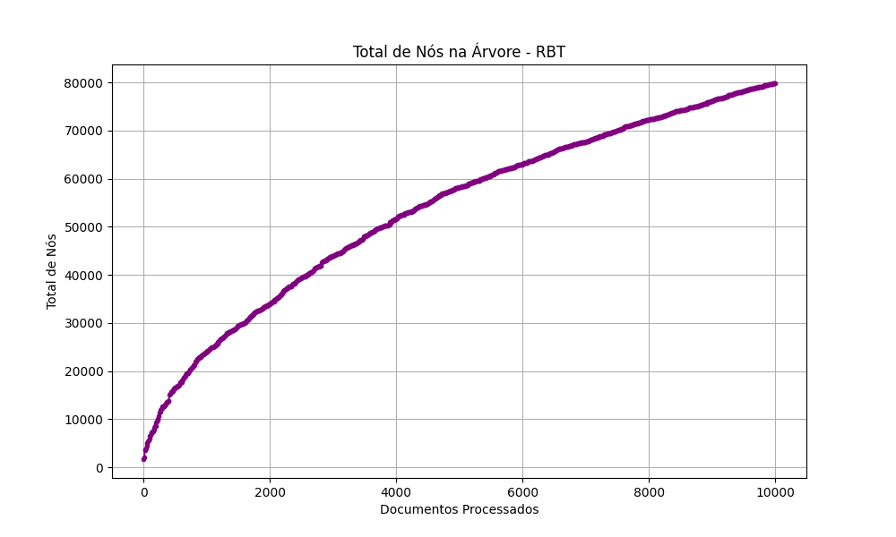

Figura 21. Total de nós na RBT. O total de nós na RBT cresce linearmente conforme novas palavras únicas são inseridas, de maneira idêntica às demais árvores. Em todas as estruturas, cada chave distinta inserida corresponde à criação de um novo nó; portanto, a quantidade total de nós aumenta proporcionalmente ao número de inserções únicas efetuadas.

# 3. Divisão de tarefas

### Bruno Cavalli  
Papel: Responsável por Benchmarks e Implementação da AVL

- Organizou a estrutura inicial do repositório (src/, data/, docs/) e realocou arquivos nas pastas corretas.  
- Implementou AVL: inserção, rotações, balanceamento e testes de getBalance/height; ajustou a lógica até compatibilizar com o framework.  
- Escreveu rotinas de leitura do corpus (10 000 documentos) e integrou-as às mains.  
- Criou benchmarks padronizados para BST e AVL — coleta de tempo, altura, nº de comparações — com exportação CSV automática.  
- Documentou e expandiu value_utils; removeu binários/temporários, mantendo o repositório enxuto.  
- Sincronizou constantemente a branch bruno2branch com main e blzrefactor, resolvendo conflitos de benchmarks e leitura.

---

### Bruno Luis Zerbinato Rosa
Papel: Desenvolvedor Principal de Algoritmos e Benchmarks

- Implementou a BST completa (v 1.0 → 2.0) e entregou a RBT estável (v 1.2.5); corrigiu pontos críticos da AVL.  
- Criou o módulo *bench_utils, programas bench_, test_framework (v 0.1 → 1.2) e Makefiles dedicados.  
- Desenvolveu as mains main_bst, main_avl, main_rbt e iniciou cli_utils.  
- Adicionou utilidades (value_utils, less_than, tree_utils) e heap-sort para ordenar arquivos.  
- Automatizou build/limpeza (.gitignore) e conduziu merges entre main, blzbranch, kauanrefactor, revisando o código integrado.

---

### Kauan Kevem Sousa Farias 
Papel: Documentação e Integração

- Padronizou todos os cabeçalhos (*.h) com Doxygen, exemplos e pré/pós-condições.  
- Atualizou o README com instruções de build (make) e uso da CLI (search, stats).  
- Realizou múltiplos merges (main, kauan, blzbranch, kauanrefactor), resolvendo conflitos de código e documentação.  
- Definiu convenções de nomenclatura/comentário; forneceu templates de docstring e checklist de boas práticas.  
- Atuou como ponto de contato para dúvidas de documentação e estrutura de pastas.

---

### Gustavo Oliveira 
Papel: Testes e Correções

- Criou *test_bst.cpp, **test_avl.cpp, **test_rbt.cpp* cobrindo inserção, busca, rotações e destruição; ampliou a AVL para 17 cenários.  
- Refinou o framework de testes, Makefile dedicado e README da suíte.  
- Corrigiu rebalanceamento da AVL e rotações da RBT; implementou funções de comparação em LessThan.  
- Removeu binários/temporários, padronizou .gitignore, limpou comentários obsoletos.  
- Manteve integração contínua com main, blzbranch, kauan, artur.

---

### Artur Vidal Krause  
Papel: Responsável pela CLI e Estrutura do Repositório

- Definiu a estrutura de pastas e adicionou o corpus de 10 000 documentos.  
- Desenvolveu a CLI completa (search, stats) com parsing robusto; criou funções genéricas searchTree e runStats.  
- Implementou main_avl integrando AVL ao fluxo da CLI.  
- Atualizou o README com exemplos de uso e preparo do corpus.  
- Realizou merges (main, kauan, blzbranch) para manter a branch artur sincronizada.